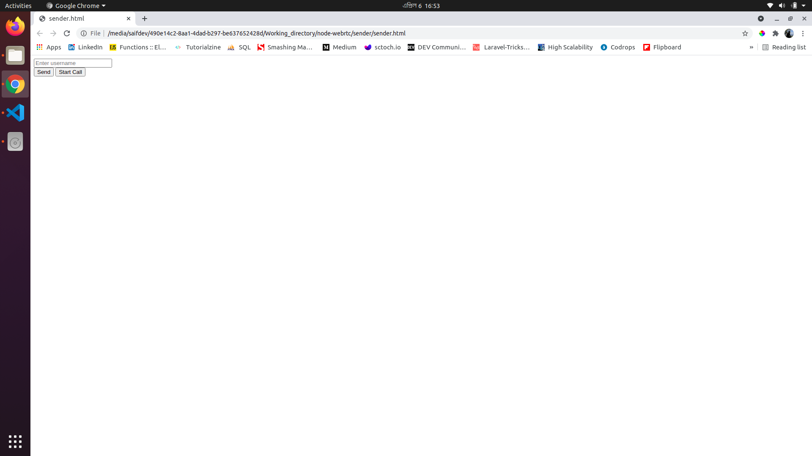
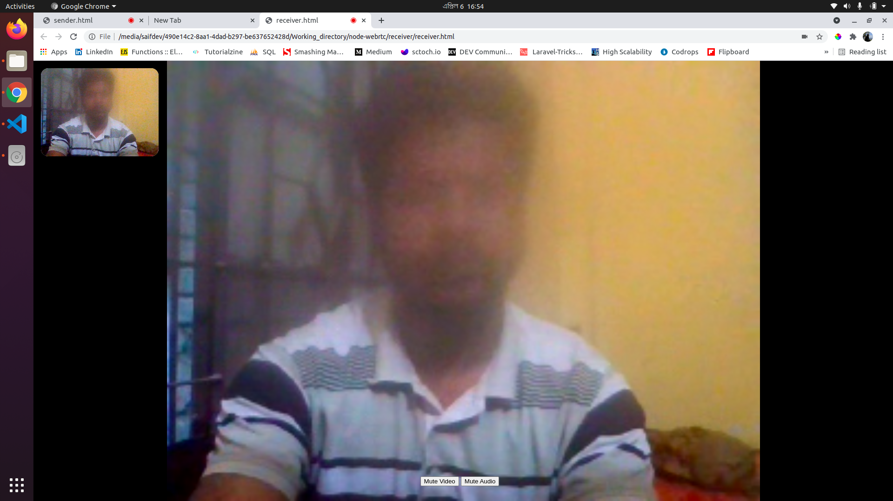
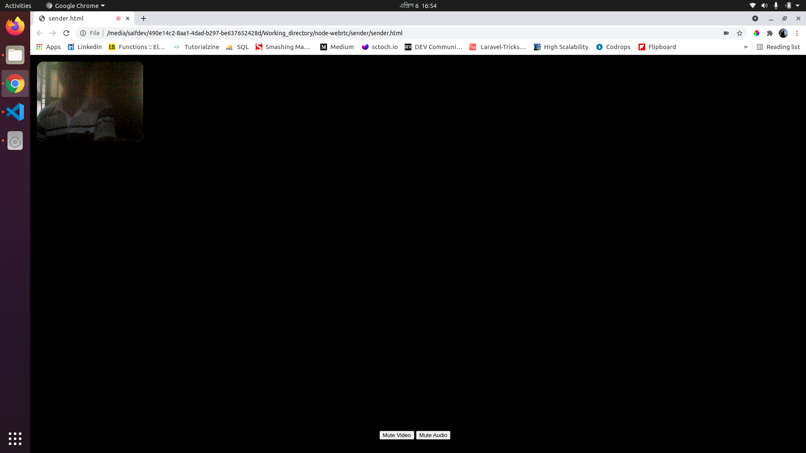

# Video Calling App
  A  video calling system using webrtc and node websocket as a signaling server.

# Install 
  1. clone the repo
  2. npm install
  3. npm start

# Usage
  1. As a sender enter your username and send it to the signaling server. Then click start video call button
  2. As a reciever enter sender username and join the call
  3. User can mute audio and video using mute audio/video button 

